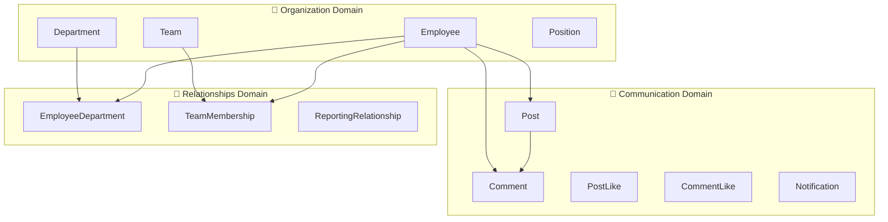
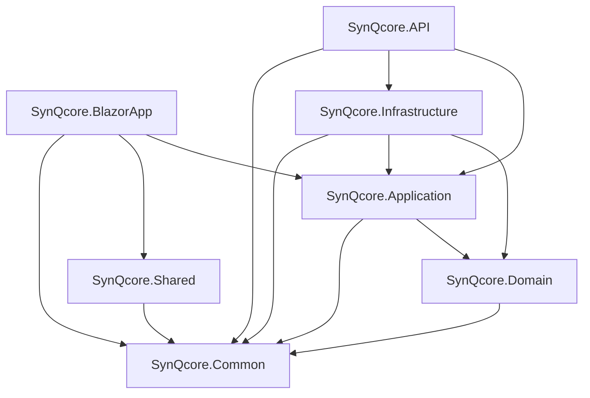

# 🏗️ SynQcore - Documentação de Arquitetura

## 📋 Visão Geral

**SynQcore** é uma rede social corporativa construída com **Clean Architecture**, seguindo os princípios SOLID e Domain-Driven Design (DDD). A arquitetura é projetada para ser escalável, testável e mantível em ambientes corporativos.

## 🎯 Princípios Arquiteturais

- **Clean Architecture** - Independência de frameworks e UI
- **Domain-Driven Design** - Modelagem baseada no domínio de negócio
- **CQRS** - Separação de responsabilidades entre Commands e Queries
- **Repository Pattern** - Abstração da camada de dados
- **Dependency Injection** - Inversão de controle e baixo acoplamento
- **Corporate Security** - Autenticação JWT + Role-based authorization

## 🏛️ Estrutura de Camadas

```
┌─────────────────────────────────────────────────────────┐
│                    Presentation Layer                    │
│  ┌─────────────────────┐    ┌─────────────────────┐     │
│  │   SynQcore.API      │    │ SynQcore.BlazorApp  │     │
│  │   (REST Endpoints)  │    │  (Hybrid UI/WASM)   │     │
│  └─────────────────────┘    └─────────────────────┘     │
└─────────────────────────────────────────────────────────┘
                              │
┌─────────────────────────────────────────────────────────┐
│                   Application Layer                     │
│  ┌─────────────────────────────────────────────────────┐ │
│  │            SynQcore.Application                     │ │
│  │  • Commands/Queries (CQRS)                         │ │
│  │  • Handlers (MediatR)                              │ │
│  │  • DTOs & Validators                               │ │
│  │  • AutoMapper Profiles                             │ │
│  └─────────────────────────────────────────────────────┘ │
└─────────────────────────────────────────────────────────┘
                              │
┌─────────────────────────────────────────────────────────┐
│                    Domain Layer                         │
│  ┌─────────────────────────────────────────────────────┐ │
│  │              SynQcore.Domain                        │ │
│  │  • Entities (12 Corporate Models)                  │ │
│  │  • Value Objects                                   │ │
│  │  • Domain Services                                 │ │
│  │  • Interfaces                                      │ │
│  │  • Business Rules & Invariants                     │ │
│  └─────────────────────────────────────────────────────┘ │
└─────────────────────────────────────────────────────────┘
                              │
┌─────────────────────────────────────────────────────────┐
│                 Infrastructure Layer                    │
│  ┌─────────────────────┐    ┌─────────────────────┐     │
│  │ SynQcore.Infrastructure  │ │   SynQcore.Common   │     │
│  │  • EF Core Context       │ │   • Shared Utils    │     │
│  │  • Repositories          │ │   • Extensions      │     │
│  │  • External Services     │ │   • Constants       │     │
│  └─────────────────────┘    └─────────────────────┘     │
└─────────────────────────────────────────────────────────┘
                              │
┌─────────────────────────────────────────────────────────┐
│                  External Dependencies                  │
│     PostgreSQL 16 • Redis 7 • Docker • JWT Auth       │
└─────────────────────────────────────────────────────────┘
```

## 🎨 Mapa de Domínios

### 📊 Três Domínios Principais



## 🗃️ Modelo de Entidades

### 👥 Organization Domain

#### Employee (Funcionário)
```csharp
Employee
├── Id: Guid (PK)
├── FirstName: string
├── LastName: string
├── Email: string (Unique)
├── Phone: string?
├── HireDate: DateTime
├── IsActive: bool
├── ManagerId: Guid? (FK → Employee)
├── AvatarUrl: string?
├── Manager: Employee? (Navigation)
├── Subordinates: List<Employee> (Navigation)
├── EmployeeDepartments: List<EmployeeDepartment>
└── TeamMemberships: List<TeamMembership>
```

#### Department (Departamento)
```csharp
Department
├── Id: Guid (PK)
├── Name: string
├── Description: string?
├── IsActive: bool
└── EmployeeDepartments: List<EmployeeDepartment>
```

#### Team (Equipe)
```csharp
Team
├── Id: Guid (PK)
├── Name: string
├── Description: string?
├── IsActive: bool
└── TeamMemberships: List<TeamMembership>
```

### 💬 Communication Domain

#### Post (Publicação)
```csharp
Post
├── Id: Guid (PK)
├── Content: string
├── AuthorId: Guid (FK → Employee)
├── Visibility: PostVisibility (Public, Department, Team, Private)
├── Author: Employee (Navigation)
├── Comments: List<Comment>
└── PostLikes: List<PostLike>
```

#### Comment (Comentário)
```csharp
Comment
├── Id: Guid (PK)
├── Content: string
├── PostId: Guid (FK → Post)
├── AuthorId: Guid (FK → Employee)
├── Post: Post (Navigation)
├── Author: Employee (Navigation)
└── CommentLikes: List<CommentLike>
```

### 🔗 Relationships Domain

#### EmployeeDepartment (Funcionário-Departamento)
```csharp
EmployeeDepartment
├── Id: Guid (PK)
├── EmployeeId: Guid (FK)
├── DepartmentId: Guid (FK)
├── StartDate: DateTime
├── EndDate: DateTime?
├── IsActive: bool
├── IsPrimary: bool
├── RoleInDepartment: string?
├── Employee: Employee (Navigation)
└── Department: Department (Navigation)
```

## 🔧 Fluxo CQRS

### Commands (Escrita)
```
┌─────────────────┐    ┌──────────────────┐    ┌─────────────────┐
│   Controller    │───▶│   Command        │───▶│   Handler       │
│                 │    │                  │    │                 │
│ • EmployeesCtrl │    │ • CreateEmployee │    │ • CreateEmpHndlr│
│ • AuthCtrl      │    │ • UpdateEmployee │    │ • UpdateEmpHndlr│
└─────────────────┘    │ • DeleteEmployee │    │ • DeleteEmpHndlr│
                       └──────────────────┘    └─────────────────┘
                                │                        │
                       ┌──────────────────┐    ┌─────────────────┐
                       │   Validation     │    │   Repository    │
                       │                  │    │                 │
                       │ • FluentValid.   │    │ • EF Core       │
                       │ • Business Rules │    │ • DbContext     │
                       └──────────────────┘    └─────────────────┘
```

### Queries (Leitura)
```
┌─────────────────┐    ┌──────────────────┐    ┌─────────────────┐
│   Controller    │───▶│     Query        │───▶│   Handler       │
│                 │    │                  │    │                 │
│ • GET /employees│    │ • GetEmployees   │    │ • GetEmpsHandler│
│ • GET /emp/{id} │    │ • GetEmployeeById│    │ • GetEmpByIdHndl│
└─────────────────┘    │ • SearchEmployees│    │ • SearchEmpHndl │
                       └──────────────────┘    └─────────────────┘
                                │                        │
                       ┌──────────────────┐    ┌─────────────────┐
                       │   AutoMapper     │    │   Read Models   │
                       │                  │    │                 │
                       │ • Entity → DTO   │    │ • Optimized     │
                       │ • Projections    │    │ • Cached        │
                       └──────────────────┘    └─────────────────┘
```

## 🔐 Arquitetura de Segurança

### Autenticação & Autorização
```
┌─────────────────┐    ┌──────────────────┐    ┌─────────────────┐
│   JWT Token     │───▶│   Middleware     │───▶│  Authorization  │
│                 │    │                  │    │                 │
│ • Bearer Token  │    │ • Authentication │    │ • Role-based    │
│ • Claims        │    │ • Rate Limiting  │    │ • Policy-based  │
│ • Expiration    │    │ • CORS           │    │ • HR/Admin      │
└─────────────────┘    └──────────────────┘    └─────────────────┘
```

### Rate Limiting Corporativo
```
Employee: 100 requests/minute
Manager:  200 requests/minute
HR:       500 requests/minute
Admin:    500 requests/minute
```

## 💾 Arquitetura de Dados

### Banco de Dados (PostgreSQL 16)
```
┌─────────────────────────────────────────────────────────┐
│                     PostgreSQL 16                      │
│  ┌─────────────────┐    ┌─────────────────────────────┐ │
│  │   Identity      │    │      Business Tables       │ │
│  │                 │    │                             │ │
│  │ • AspNetUsers   │    │ • Employees (12 columns)   │ │
│  │ • AspNetRoles   │    │ • Departments (5 columns)  │ │
│  │ • AspNetClaims  │    │ • Teams (5 columns)        │ │
│  │ • AspNetTokens  │    │ • Posts (8 columns)        │ │
│  └─────────────────┘    │ • Comments (7 columns)     │ │
│                         │ • Relationships (3 tables) │ │
│                         └─────────────────────────────┘ │
└─────────────────────────────────────────────────────────┘
```

### Cache Layer (Redis 7)
```
┌─────────────────────────────────────────────────────────┐
│                       Redis 7                          │
│  ┌─────────────────┐    ┌─────────────────────────────┐ │
│  │  Rate Limiting  │    │      Application Cache     │ │
│  │                 │    │                             │ │
│  │ • Client Rules  │    │ • Employee Lists            │ │
│  │ • Request Count │    │ • Department Hierarchy      │ │
│  │ • Time Windows  │    │ • Search Results            │ │
│  └─────────────────┘    │ • Session Data              │ │
│                         └─────────────────────────────┘ │
└─────────────────────────────────────────────────────────┘
```

## 📦 Dependências entre Projetos



## 🎯 Padrões Implementados

### 1. **CQRS (Command Query Responsibility Segregation)**
- Commands para operações de escrita (Create, Update, Delete)
- Queries para operações de leitura (Get, Search, List)
- Handlers separados para cada operação

### 2. **MediatR Pipeline**
- ValidationBehavior para validação automática
- AuditBehavior para trilhas de auditoria
- LoggingBehavior para logs estruturados

### 3. **Repository Pattern**
- ISynQcoreDbContext para abstração
- EF Core como implementação
- Unit of Work implícito via DbContext

### 4. **Domain Events (Preparado)**
- BaseEntity preparado para domain events
- Infrastructure para publishing events
- Handlers para processamento assíncrono

### 5. **Soft Delete Pattern**
- BaseEntity com IsDeleted
- MarkAsDeleted() method
- Global query filters no EF Core

## 🚀 Pipeline de Build e Deploy

### Development Environment
```bash
# 1. Docker Compose (Infrastructure)
docker-compose up -d

# 2. Database Migration
dotnet ef database update

# 3. API Startup
dotnet run --project SynQcore.Api

# 4. Blazor App (Future)
dotnet run --project SynQcore.BlazorApp
```

### Production Environment (Planned)
```yaml
# Docker Production Stack
services:
  api:
    image: synqcore/api:latest
    ports: ["5000:5000"]
  
  blazor:
    image: synqcore/blazor:latest
    ports: ["5001:5001"]
  
  postgres:
    image: postgres:16
    volumes: ["/data/postgres:/var/lib/postgresql/data"]
  
  redis:
    image: redis:7
    volumes: ["/data/redis:/data"]
```

## 📊 Métricas de Qualidade

### Cobertura de Testes (Target)
```
┌─────────────────┬──────────┬──────────┐
│     Camada      │ Atual    │ Target   │
├─────────────────┼──────────┼──────────┤
│ Domain          │    0%    │   95%    │
│ Application     │    0%    │   85%    │
│ Infrastructure  │    0%    │   70%    │
│ API             │    0%    │   80%    │
└─────────────────┴──────────┴──────────┘
```

### Performance Targets
```
┌─────────────────┬──────────┬──────────┐
│     Métrica     │ Atual    │ Target   │
├─────────────────┼──────────┼──────────┤
│ API Response    │  < 200ms │  < 100ms │
│ Database Query  │  < 50ms  │  < 20ms  │
│ Page Load       │    TBD   │  < 2s    │
│ Build Time      │   ~15s   │  < 30s   │
└─────────────────┴──────────┴──────────┘
```

## 🔮 Roadmap Arquitetural

### Fase 3 (Próxima)
- [ ] Domain Events implementation
- [ ] Advanced caching strategies
- [ ] Background job processing
- [ ] Real-time features (SignalR)

### Fase 4-5
- [ ] Microservices preparation
- [ ] Event sourcing (optional)
- [ ] CQRS with separate read/write databases
- [ ] Advanced search (ElasticSearch)

### Fase 6-8
- [ ] Multi-tenancy support
- [ ] Horizontal scaling
- [ ] Kubernetes deployment
- [ ] Observability stack (Metrics, Tracing, Logs)

---

*Documento atualizado em: 25 de Setembro de 2025*  
*Versão: 1.0*  
*Próxima revisão: Após Fase 3*