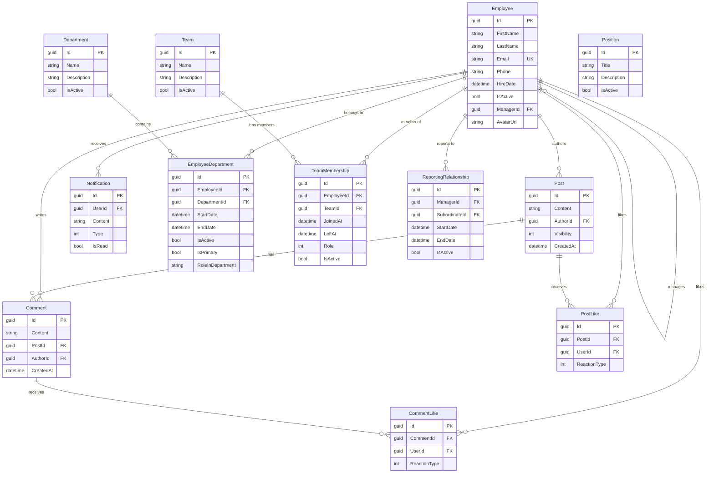
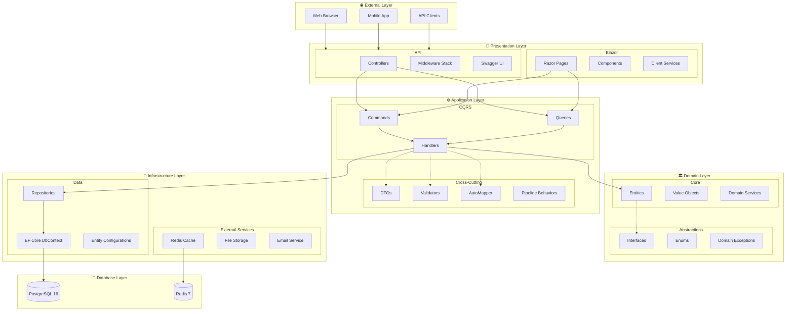
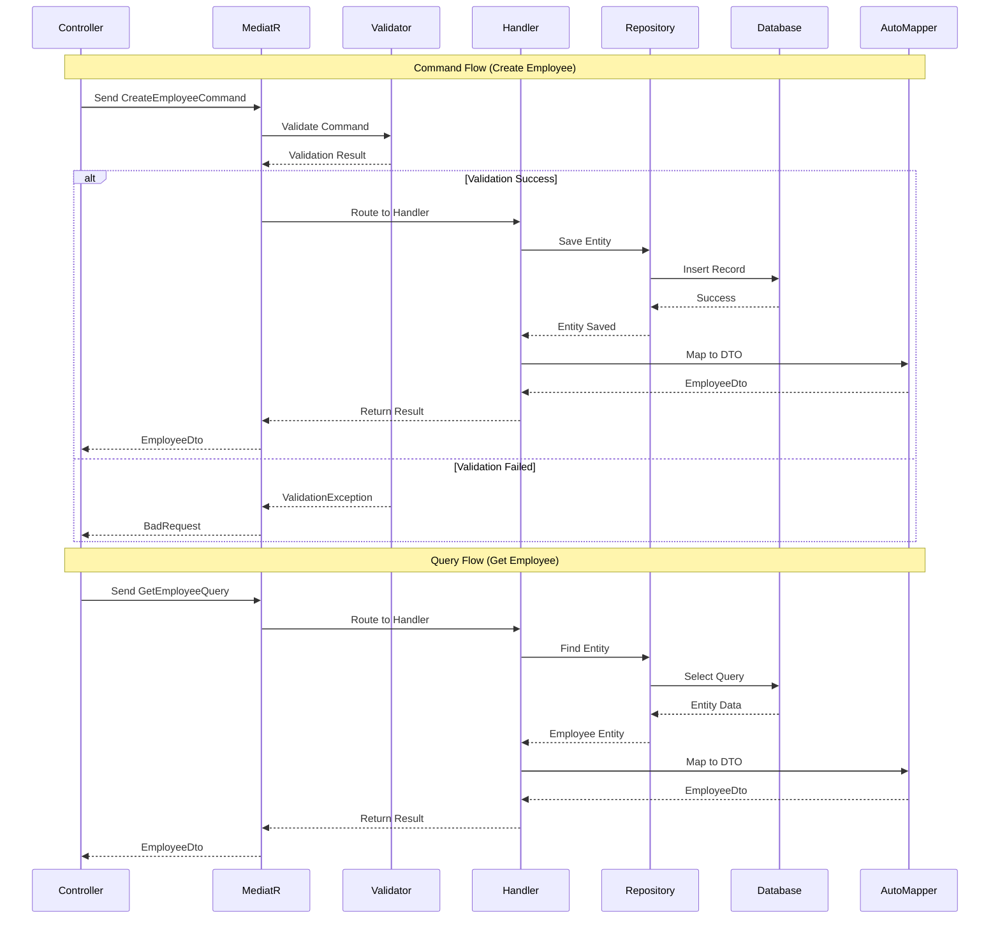
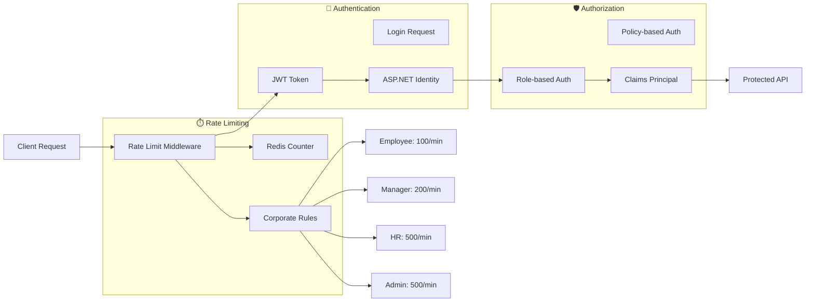
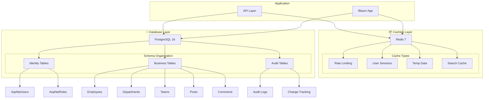
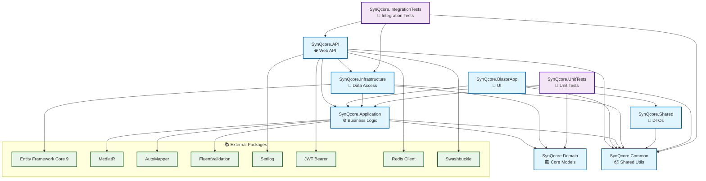
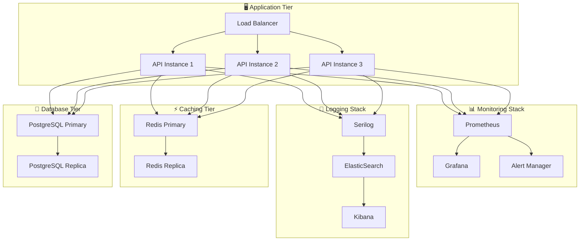

# 🎨 SynQcore - Diagramas Visuais da Arquitetura

## 📊 Diagrama de Entidades (Entity Relationship)

## 🏗️ Diagrama de Arquitetura em Camadas

## 🔄 Diagrama de Fluxo CQRS

## 🔐 Diagrama de Segurança

## 📊 Diagrama de Dados

## 🎯 Diagrama de Dependências

## 🚀 Diagrama de Pipeline de CI/CD (Planejado)

```mermaid
graph LR
    %% Source Control
    subgraph "📝 Source"
        Git[Git Repository]
        PR[Pull Request]
    end
    
    %% Build Pipeline
    subgraph "🔨 Build Pipeline"
        Checkout[Checkout Code]
        Restore[Restore Packages]
        Build[Build Solution]
        Test[Run Tests]
        Pack[Package App]
    end
    
    %% Quality Gates
    subgraph "✅ Quality Gates"
        CodeCoverage[Code Coverage > 80%]
        SonarQube[SonarQube Analysis]
        SecurityScan[Security Scan]
    end
    
    %% Deployment Pipeline
    subgraph "🚀 Deployment"
        DockerBuild[Build Docker Images]
        Registry[Push to Registry]
        Deploy_Dev[Deploy to Dev]
        Deploy_Staging[Deploy to Staging]
        Deploy_Prod[Deploy to Production]
    end
    
    %% Flow
    Git --> Checkout
    PR --> Checkout
    Checkout --> Restore
    Restore --> Build
    Build --> Test
    Test --> Pack
    
    Pack --> CodeCoverage
    CodeCoverage --> SonarQube
    SonarQube --> SecurityScan
    
    SecurityScan --> DockerBuild
    DockerBuild --> Registry
    Registry --> Deploy_Dev
    Deploy_Dev --> Deploy_Staging
    Deploy_Staging --> Deploy_Prod
```

## 📈 Diagrama de Performance e Monitoramento

---

*Diagramas criados em: 25 de Setembro de 2025*  
*Ferramentas: Mermaid.js*  
*Versão: 1.0*